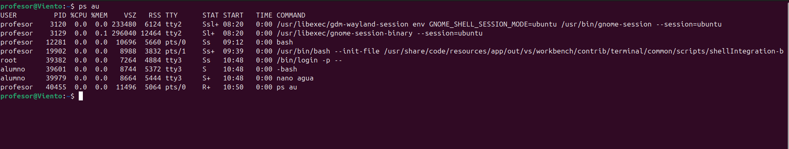
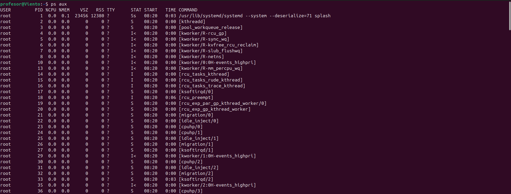
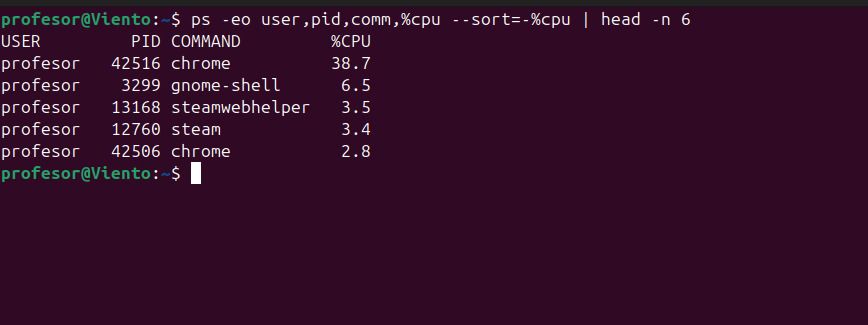
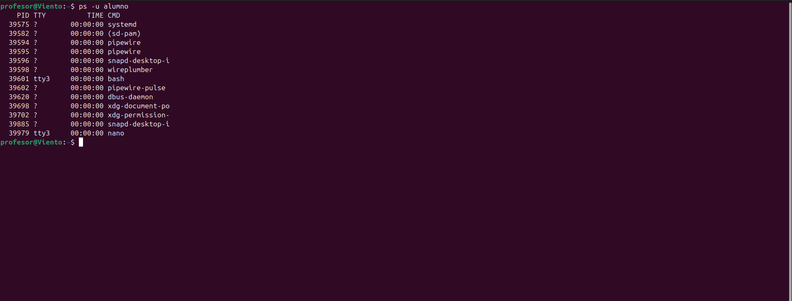
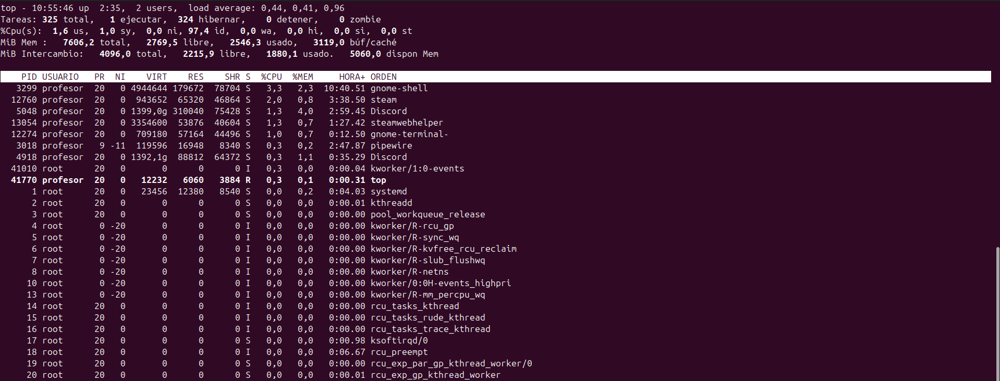
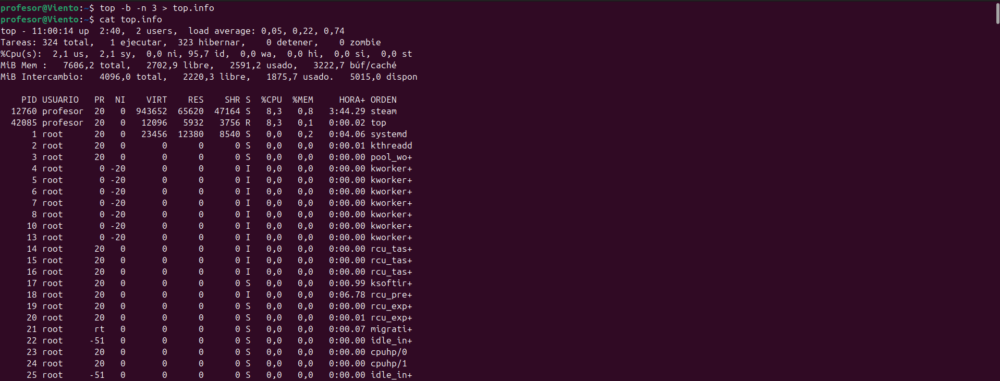
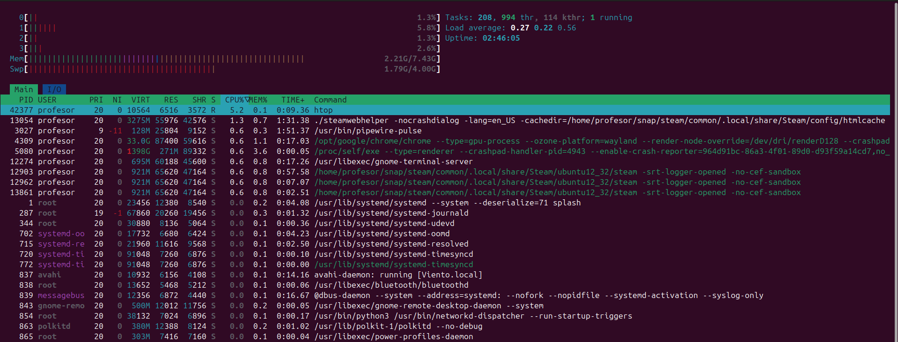
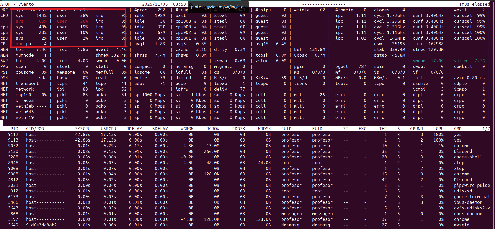

# Unidad 1: Monitorización de Procesos


---

## 1. `ps` 

El comando `ps` muestra información sobre los procesos activos en el sistema.

### Uso básico
```bash
ps
```

**Descripción:** Muestra los procesos del usuario actual en la terminal actual.

### Captura de ejemplo


**Información mostrada:**
- **PID:** Identificador del proceso
- **TTY:** Terminal asociada
- **TIME:** Tiempo de CPU consumido
- **CMD:** Comando ejecutado

---

## 2. `ps aux` 

```bash
ps aux
```

**Descripción:** Muestra todos los procesos del sistema con información detallada.

### Captura de ejemplo


**Columnas principales:**
- **USER:** Usuario propietario del proceso
- **PID:** ID del proceso
- **%CPU:** Porcentaje de CPU utilizado
- **%MEM:** Porcentaje de memoria utilizado
- **VSZ:** Memoria virtual en KB
- **RSS:** Memoria física en KB
- **STAT:** Estado del proceso
- **START:** Hora de inicio
- **TIME:** Tiempo de CPU acumulado
- **COMMAND:** Comando completo

---

## 3. `ps -eo`

```bash
ps -eo user,pid,%cpu,%mem,cmd
```

**Descripción:** Permite seleccionar qué columnas mostrar para personalizar la salida.

### Captura de ejemplo



---

## 4. `ps -u` - Procesos de un usuario

```bash
ps -u usuario
```

**Descripción:** Muestra únicamente los procesos de un usuario específico.


### Captura de ejemplo



---

## 5. `top` 

```bash
top
```

**Descripción:** Monitor interactivo en tiempo real que muestra los procesos y el uso de recursos del sistema.

### Captura de ejemplo



**Secciones principales:**
- **Resumen del sistema:** Uptime, usuarios, carga promedio
- **Tareas:** Total, en ejecución, durmiendo, detenidas, zombies
- **CPU:** Uso de usuario, sistema, idle, wait
- **Memoria:** Total, usada, libre, buffers/cache
- **Lista de procesos:** Ordenados por uso de CPU
- 

**Teclas útiles en top:**
- `q` - Salir
- `k` - Matar proceso
- `M` - Ordenar por memoria
- `P` - Ordenar por CPU
- `h` - Ayuda

---

## 6. `top -b -n`

```bash
top -b -n 3
```

**Descripción:** Ejecuta top en modo no interactivo, útil para guardar la salida en archivos.


### Captura de ejemplo



**Parámetros:**
- `-b` - Modo batch (no interactivo)
- `-n 3` - Número de iteraciones (3 en este caso)
- 

**Uso práctico:**

Guardar en archivo


```bash
top -b -n 3 > top.info
```

---

## 7. `htop` 

```bash
htop
```

**Descripción:** Versión mejorada y más visual de top, con interfaz a color y más intuitiva.

### Captura de ejemplo



**Ventajas sobre top:**
- Interfaz en color
- Scroll vertical y horizontal
- Selección con ratón
- Visualización de árbol de procesos
- Más fácil de usar
  

**Teclas útiles:**
- `F1` - Ayuda
- `F2` - Configuración
- `F3` - Buscar proceso
- `F4` - Filtrar
- `F5` - Vista de árbol
- `F9` - Matar proceso
- `F10` - Salir

---

## 8. `atop` 

```bash
atop
```

**Descripción:** Monitor de sistema avanzado que guarda información histórica y permite análisis detallado.

### Captura de ejemplo



**Características principales:**
- Información detallada de CPU, memoria, disco y red
- Almacena logs históricos
- Puede mostrar procesos finalizados
- Estadísticas por proceso muy completas
- 

**Teclas útiles:**
- `m` - Ordenar por uso de memoria
- `c` - Ordenar por uso de CPU
- `d` - Ordenar por uso de disco
- `n` - Ordenar por uso de red
- `t` - Ir adelante en el tiempo
- `T` - Ir atrás en el tiempo
- `q` - Salir
