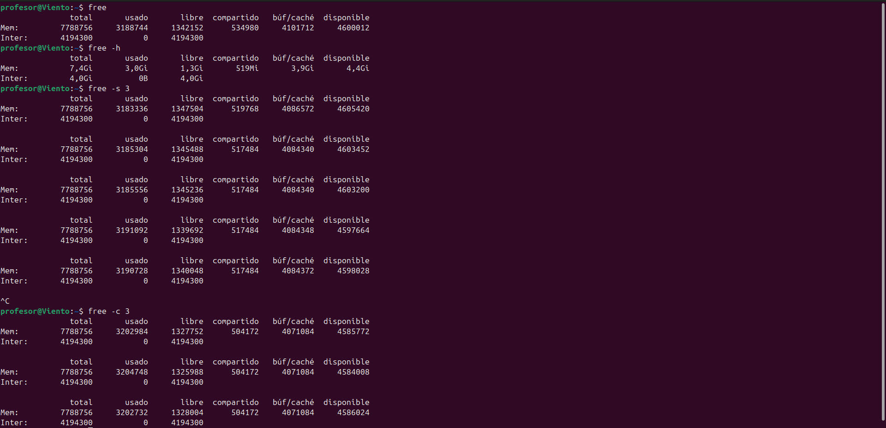
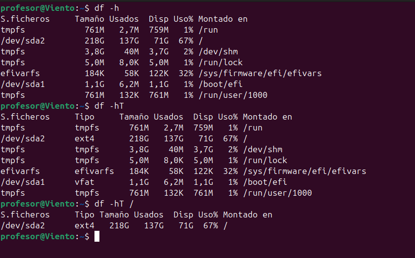
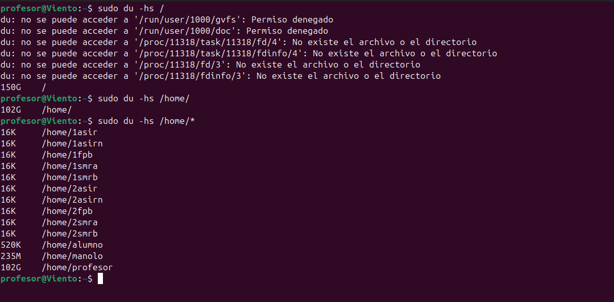
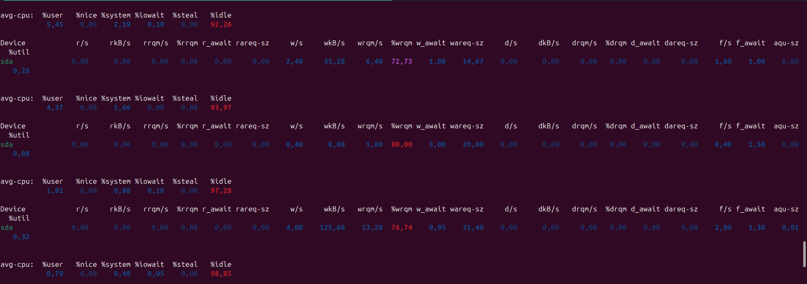

# Unidad 2: Memoria, Espacio Y Rendimiento del Disco


## 1. `free`

```bash
free
```

**Descripción:** Muestra la cantidad de memoria libre y usada en el sistema, tanto RAM como swap.

### Captura de ejemplo


**Información mostrada:**
- **total:** Memoria total instalada
- **used:** Memoria en uso
- **free:** Memoria completamente libre
- **shared:** Memoria compartida entre procesos
- **buff/cache:** Memoria usada para buffers y caché
- **available:** Memoria disponible para nuevos procesos

### Opciones útiles

```bash
free -h    # Formato legible para humanos (GB, MB)
free -m    # Mostrar en megabytes
free -g    # Mostrar en gigabytes
free -s x  # Actualizar cada x segundos
```


## 2. `df -h` - Espacio en formato legible

```bash
df -h
```

**Descripción:** Muestra el espacio en disco en formato legible (KB, MB, GB, TB).

### Captura de ejemplo



**Columnas:**
- **Filesystem:** Sistema de archivos o dispositivo
- **Size:** Tamaño total
- **Used:** Espacio usado
- **Avail:** Espacio disponible
- **Use%:** Porcentaje de uso
- **Mounted on:** Punto de montaje
  

**Opciones adicionales:**

```bash
df -h /home          # Espacio de una partición específica
df -h --total        # Incluir total general
df -hT               # Mostrar también el tipo de sistema de archivos
```


---

## 3. `du` 

```bash
du
```

**Descripción:** Estima el espacio usado por archivos y directorios.

### Captura de ejemplo


### Opciones más útiles

```bash
du -h              # Formato legible
du -h --max-depth=1  # Solo un nivel de profundidad
du -sh *           # Resumen de cada elemento del directorio actual

```

### Captura con formato optimizado


**Casos de uso:**
- Identificar qué directorios ocupan más espacio
- Encontrar archivos grandes para limpieza
- Auditar uso de disco por usuario o proyecto

**Ejemplo práctico:**
```bash
# Los 10 directorios más grandes
du -h /home | sort -hr | head -10

# Espacio total de un directorio
du -sh /var/log
```

---

## 4. `iostat`

```bash
iostat
```

**Descripción:** Muestra estadísticas de uso de CPU y entrada/salida de dispositivos de almacenamiento.

### Captura de ejemplo


**Secciones:**

### CPU
- **%user:** Tiempo en procesos de usuario
- **%nice:** Tiempo en procesos con prioridad modificada
- **%system:** Tiempo en procesos del kernel
- **%iowait:** Tiempo esperando E/S 
- **%steal:** Tiempo robado por hipervisor
- **%idle:** Tiempo inactivo

### Dispositivos
- **tps:** Transferencias por segundo
- **kB_read/s:** KB leídos por segundo
- **kB_wrtn/s:** KB escritos por segundo
- **kB_read:** Total KB leídos
- **kB_wrtn:** Total KB escritos

### Opciones avanzadas

```bash
iostat -x           # Estadísticas extendidas
iostat -x 2 5       # Actualizar cada 2 seg, 5 veces
iostat -d           # Solo dispositivos
iostat -c           # Solo CPU
iostat -m           # En megabytes
iostat -p sda       # Solo dispositivo específico
```

