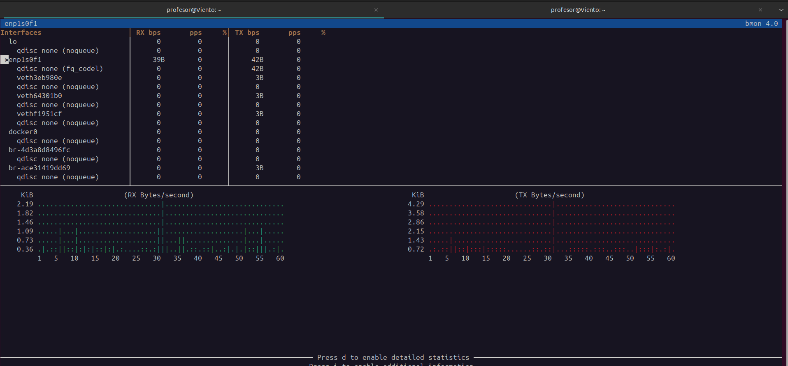
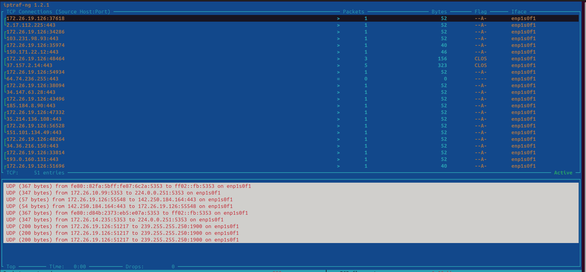
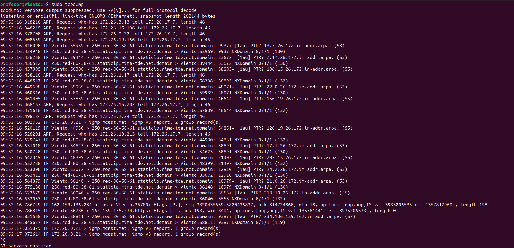
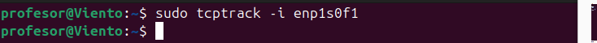
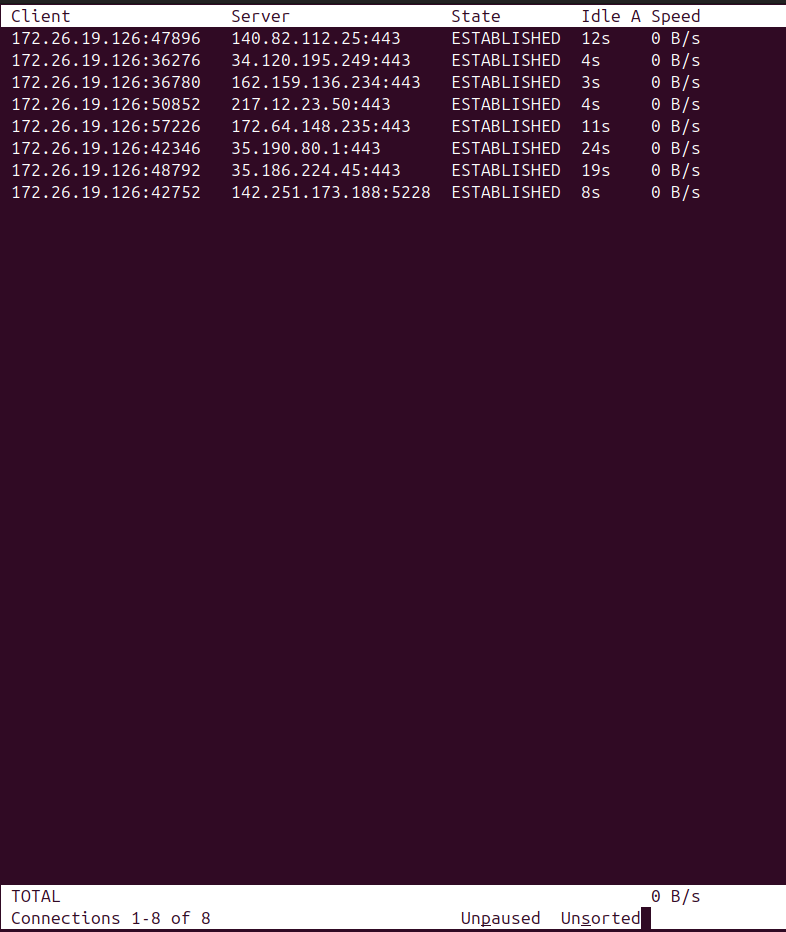

# Unidad 3: Monitorización del Tráfico de Red


## 1. `bmon` 

```bash
bmon
```

**Descripción:** Monitor de ancho de banda en tiempo real con interfaz gráfica en terminal. Muestra estadísticas de tráfico para todas las interfaces de red.

### Captura de ejemplo



**Navegación:**
- `d` - Cambiar vista de detalle
- `g` - Cambiar tipo de gráfico
- `i` - Seleccionar interfaz
- `q` - Salir

---

## 2. `iptraf` 

```bash
sudo iptraf-ng
```

**Descripción:** Monitor interactivo de tráfico IP con menús y múltiples vistas de análisis de red.

### Captura de ejemplo


**Opciones del menú principal:**
1. **IP traffic monitor:** Tráfico en tiempo real por conexión
2. **General interface statistics:** Estadísticas por interfaz
3. **Detailed interface statistics:** Información detallada de una interfaz
4. **Statistical breakdowns:** Desglose por protocolo y tamaño
5. **LAN station monitor:** Monitor de estaciones en red local


**Información típica mostrada:**
- IPs origen y destino
- Puertos utilizados
- Protocolo (TCP/UDP)
- Bytes transferidos
- Estado de conexión

**Teclas útiles:**
- `↑↓` - Navegar por lista
- `s` - Ordenar
- `f` - Filtros
- `x` - Cerrar ventana
- `q` - Salir


---

## 3. `tcpdump` 

```bash
sudo tcpdump
```

**Descripción:** Herramienta de línea de comandos para capturar y analizar paquetes de red. Es extremadamente potente para análisis profundo.

### Captura de Ejemplo



**Componentes:**
- **Timestamp:** Hora de captura
- **Protocolo:** IP, ARP, IPv6, etc.
- **Origen → Destino:** IPs y puertos
- **Flags:** Estado TCP [S]=SYN, [.]=ACK, [F]=FIN, [P]=PUSH
- **Datos adicionales:** Secuencia, ventana, longitud

### Opciones fundamentales

```bash
# Capturar en interfaz específica
sudo tcpdump -i eth0

# Capturar N paquetes
sudo tcpdump -c 100

# Más detalle
sudo tcpdump -v        
sudo tcpdump -vv       
sudo tcpdump -vvv     

```

### Filtros útiles

```bash
# Por host
sudo tcpdump host 192.168.1.100
sudo tcpdump src 192.168.1.100
sudo tcpdump dst 192.168.1.100

# Por puerto
sudo tcpdump port 80
sudo tcpdump port 22 or port 443

# Por protocolo
sudo tcpdump tcp
sudo tcpdump udp
sudo tcpdump icmp


```


---

## 4. `tcptrack` 

```bash
sudo tcptrack -i 'Tarjeta de red'
```

**Descripción:** Muestra las conexiones TCP activas de forma organizada y actualizada en tiempo real.

### Captura de ejemplo




**Información mostrada:**

### Columnas principales:
- **Source:** IP y puerto origen
- **Destination:** IP y puerto destino  
- **State:** Estado de la conexión TCP
- **Idle:** Tiempo de inactividad
- **Speed:** Velocidad actual de transferencia


**Navegación:**
- `p` - Pausar/reanudar
- `q` - Salir
- La vista se actualiza automáticamente


