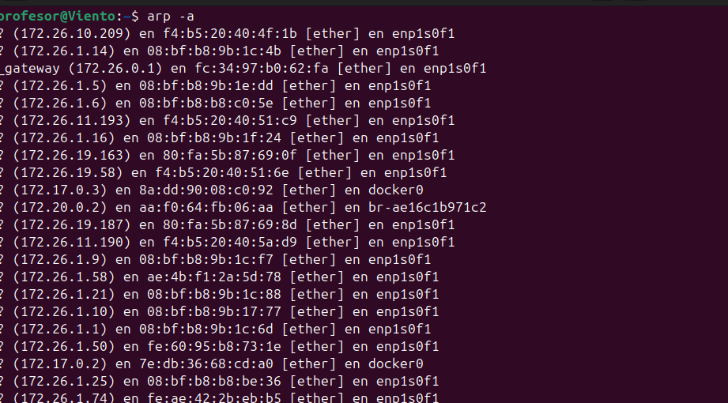
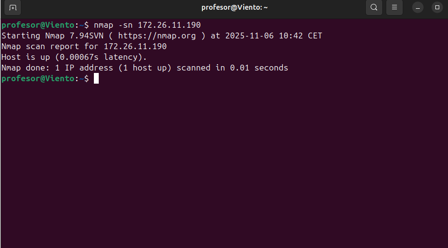
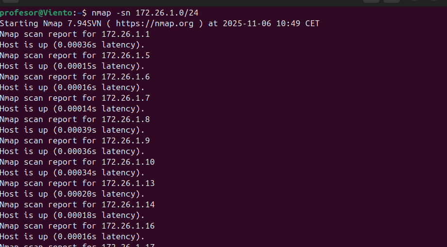
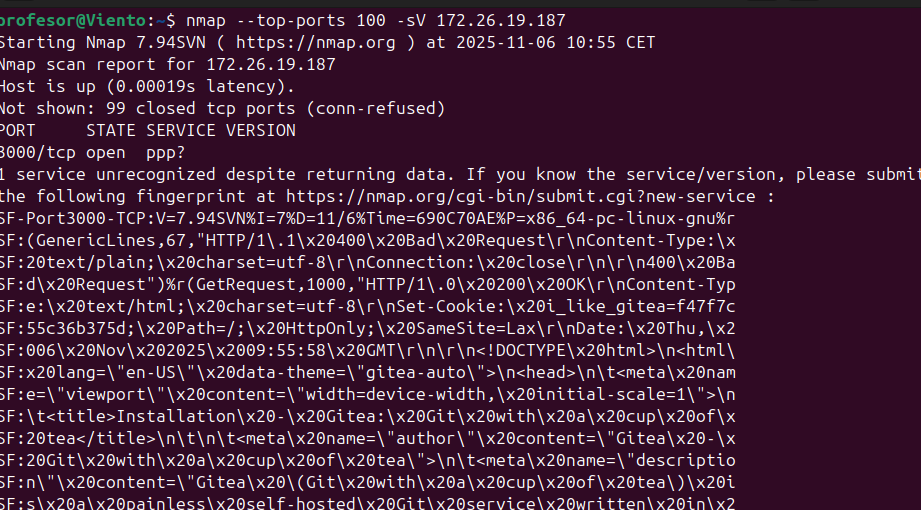
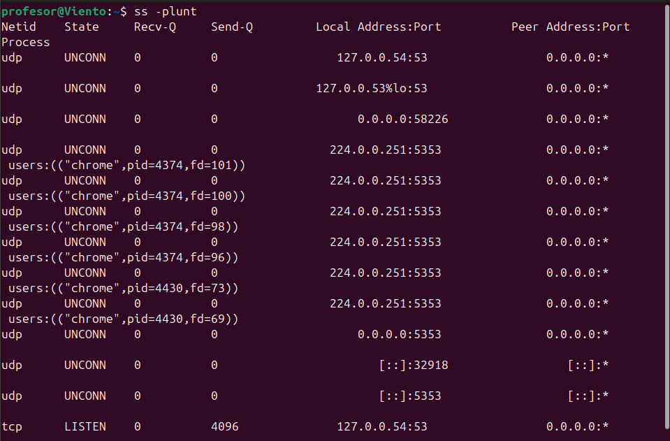
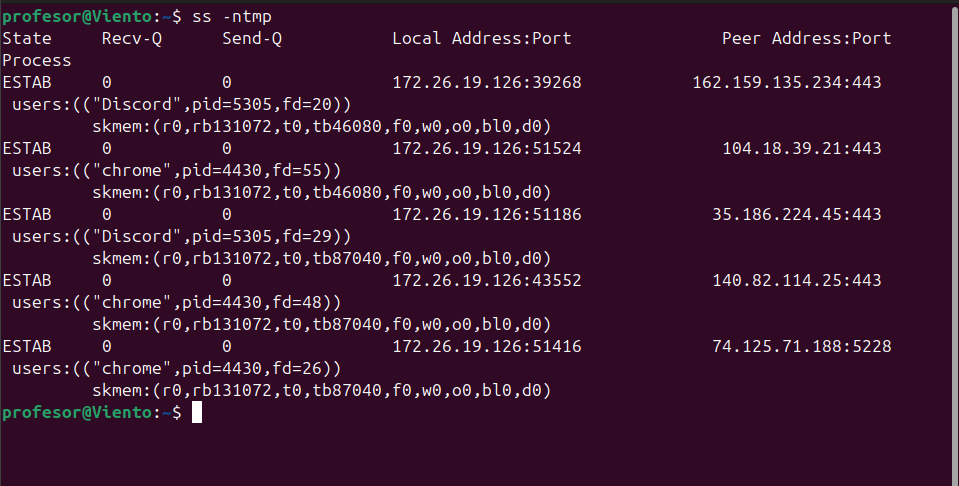
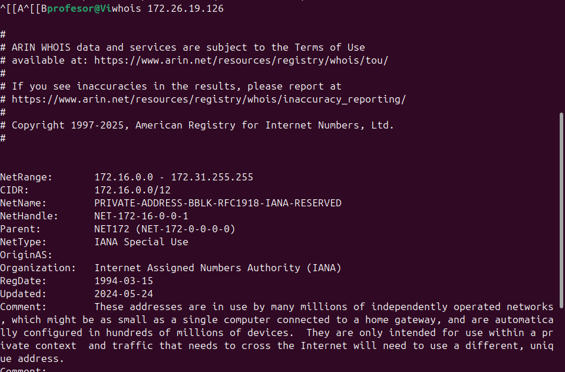

# Unidad 4: Análisis de Puertos y Servicios de Red


---

## 1. `arp -a`

```bash
arp -a
```

**Descripción:** Muestra la tabla ARP que mapea direcciones IP a direcciones MAC en la red local.

### Captura de ejemplo


**Información mostrada:**
- **Dirección IP:** IP del host en la red local
- **Dirección MAC:** Dirección física de la tarjeta de red (6 bytes en hexadecimal)
- **Tipo:** Dinámico o estático
- **Interfaz:** Interfaz de red asociada


---

## 2. `nmap` 
```bash
nmap [opciones] <objetivo>
```

**Descripción:** Herramienta de exploración de red y auditoría de seguridad. Descubre hosts, servicios, sistemas operativos y vulnerabilidades.


### Captura de ejemplo


**Información mostrada:**
- **PORT:** Número de puerto
- **STATE:** Estado (open, closed, filtered)
- **SERVICE:** Servicio asociado al puerto

**Estados de puerto:**
- **open:** Puerto abierto y aceptando conexiones
- **closed:** Puerto cerrado pero accesible
- **filtered:** Firewall bloqueando el acceso
- **unfiltered:** Accesible pero estado indeterminado
- **open|filtered:** Nmap no puede determinarlo

---

## 3. `nmap -sn ip` 


**Descripción:** Escanea los puertos más comunes de un host específico.

### Captura detallada



---

## 4. `nmap --top-ports` 


**Descripción:** Escanea solo los N puertos más comunes según la base de datos de Nmap.

### Captura de ejemplo



---

## 5. `ss -plunt` 


**Descripción:** Muestra todos los sockets TCP y UDP que están escuchando conexiones (puertos abiertos localmente).

### Captura de ejemplo


**Opciones del comando:**
- `-p` - Mostrar proceso asociado
- `-l` - Mostrar solo sockets en escucha (listening)
- `-u` - Mostrar sockets UDP
- `-n` - No resolver nombres (mostrar IPs numéricas)
- `-t` - Mostrar sockets TCP

**Información mostrada:**
- **Netid:** Protocolo (tcp, udp)
- **State:** Estado (LISTEN, ESTAB, etc.)
- **Recv-Q:** Bytes en cola de recepción
- **Send-Q:** Bytes en cola de envío
- **Local Address:Port:** Dirección y puerto local
- **Peer Address:Port:** Dirección y puerto remoto
- **Process:** PID y nombre del proceso


---

## 6. `ss -tmp` 

```bash
sudo ss -tmp
```

**Descripción:** Muestra información detallada de los sockets TCP con información de memoria y procesos.

### Captura de ejemplo


**Opciones:**
- `-t` - Solo TCP
- `-m` - Mostrar información de memoria
- `-p` - Mostrar proceso asociado


---

## 7. `whois` 

```bash
whois dominio.com
```

**Descripción:** Consulta información de registro de un dominio o dirección IP.

### Captura de ejemplo


**Información proporcionada:**
- **Registrar:** Empresa registradora del dominio
- **Registrant:** Propietario del dominio
- **Creation Date:** Fecha de registro
- **Expiration Date:** Fecha de expiración
- **Name Servers:** Servidores DNS autorizados
- **Status:** Estado del dominio
- **Admin Contact:** Contacto administrativo
- **Tech Contact:** Contacto técnico

### Ejemplos de uso:

```bash
# Información de dominio
whois google.com
whois github.com

# Información de IP
whois 8.8.8.8
